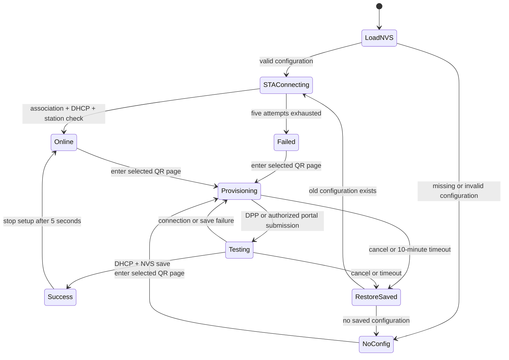

# 首次 Wi-Fi 配网

## 实现与边界

2026-10-08：已实现 NVS 启动、DPP Enrollee、WPA2 SoftAP、DNS wildcard、gzip 单 HTML portal、STA mDNS 主机名与 Settings → Network 页面。固件与 Linux simulator 的验收分开记录；编译和主机测试不代表手机 / 板上配网已验收。

`main` 在 NVS、board 就绪后启动 runtime，不再接收编译进固件的 SSID / 密码。`szpi_app/wifi_service` 是唯一 Wi-Fi 状态机与持久化操作入口；`szpi_wifi` 拥有 STA/AP netif、驱动、事件、DPP、DNS socket 与 HTTP server。共享 `szpi_ui` 仅接收模型和发出 begin/cancel/forget 事件，无 ESP-IDF / 网络 / NVS 依赖。`szpi_app_runtime_start(bool wifi_enabled, bool ui_enabled)` 的 Wi-Fi 任务只取决于启用开关，无配置也会创建。

STA 的 DHCP hostname 与 mDNS hostname 从同一个设置读取，默认 `szpi`，mDNS 地址为 `szpi.local`；设置存于 NVS namespace `szpi_wifi`、key `hostname`，最多 32 个 ASCII 字母、数字或连字符，首尾不能为连字符。`szpi_app_wifi_set_hostname()` 将更新排入 Wi-Fi owner task，持久化后同时应用到 DHCP 与 mDNS；STA 已连接时会重连以使用新 DHCP hostname，配网会话期间拒绝更新。当前状态快照包含 hostname。mDNS 实例名为 `SZ-PI`，不注册未实际运行的服务记录。`szpi_wifi` 创建 STA netif 时设置 DHCP hostname，Wi-Fi owner 在 STA/AP 启动前初始化 Espressif `espressif/mdns` `==1.12.0`，确保接收到后续 netif 事件；Wi-Fi 服务停止时释放 mDNS。组件内部 mDNS task 由依赖管理，不由 runtime 重复创建；当前配置为 4096 字节栈、优先级 1、固定 CPU0，任务及其内存均使用内部 RAM。

支持 2.4GHz WPA2-PSK、WPA3-SAE 与 WPA2/WPA3 transition；隐藏 SSID 可以手输。开放、WEP、企业 EAP 和 DPP connector-only AP 不在本次范围。SSID 为 1–32 字节，密码为 8–63 字节或 WPA2 的 64 位 hex PSK；不支持 SSID / 密码中的 NUL、控制字符。界面按项目规则嵌入 ASCII Noto Sans，非 ASCII SSID 在网页可显示，在 LCD 可能缺字。

## 用户流程

- 启动读取 `nvs/szpi_wifi/station` 的版本化 blob。有效配置直接 STA 联网；无配置只引导 LCD 进入 Network，不启动配网；进入所选方式的二维码页面后才开启 10 分钟会话。读取失败保留 NVS、记录错误并允许重新配网，不自动擦除。
- Network 第一张卡片显示保存的网络（在状态详情中区分 Connected / Offline）；进入 Current Wi-Fi 后显示 SSID、状态、IPv4、网关、子网掩码、设备 STA MAC、AP BSSID、RSSI（dBm / Strong / Fair / Weak）和信道；可上下滚动，断线后的连接详情显示 --，设备 MAC 仍可显示。需两次点击确认才能清除。清除成功后回到无配置状态，等待用户选择配网方式；配网期间禁止清除。
- `Connect a New Network` → `Easy Connect (DPP)` 或 `Wi-Fi Hotspot` → QR。两种方式使用独立页面；DPP 二维码为 196px，热点二维码为 192px，热点页右侧显示 SSID、随机密码和 `192.168.4.1`。无 Cancel 按钮，右划退出关闭当前会话。DPP 不可用时返回选择 Hotspot。
- 开始更换网络会临时断开旧 STA，但旧凭据仍保留。网页提交和 DPP 收到的凭据只进入 RAM candidate；认证、关联和 DHCP 完成且核对当前 STA 后才保存新配置。
- 测试失败保持热点和 portal，网页可以重新扫描 / 修改密码 / 重试。失败后 DPP listener 已停止，若要再次使用 DPP，需要右划退出后重新进入；SoftAP 重试无需新会话。
- 成功原子替换同一个 NVS blob，再显示成功、保留热点 5 秒让网页轮询看到结果，随后停止 DPP / HTTP / DNS / AP，保持 STA。取消在成功提交后的阶段仅关闭会话，不撤销已经保存的成功配置。
- 退出或超时在提交前停止 candidate，清除会话秘密，恢复旧 STA；如果原本没有配置，回到无配置状态，用户可再从 Network 开始。保存失败保持旧配置，提示重试或取消。

## 状态与时间预算

STA 每次尝试 15 秒，最多 5 次，间隔 1 / 2 / 4 / 8 秒。新候选测试一次、15 秒截止，失败由用户修改后重试。已有配置连接失败不会自动开热点，需本地 GUI 明确重新配网。DPP 认证错误最多重启监听 3 次，然后提示错误，用户右划返回选择热点方式。会话截止可通过 `CONFIG_SZPI_WIFI_PROVISION_TIMEOUT_S` 设置（60–600 秒，默认 600）。成功等待 5 秒结束优先于会话截止。

连接成功定义为当前目标 STA 关联并获得非零 IPv4 / netmask，不依赖外网 HTTP、NTP 或 ping。用户取消与 DHCP 事件按有界消息队列的顺序处理；NVS 保存成功是提交边界。

## SoftAP、DPP 与网页

AP 为 `Device-` 加 MAC 后 3 字节，`192.168.4.1/24`。密码每次会话生成 16 位随机字符；在 Wi-Fi 启动后使用 RF entropy，SSID 与密码先在停止的驱动上配置 WPA2 再启动 AP，避免临时开放热点。Wi-Fi QR 为 `WIFI:T:WPA;S:<escaped>;P:<escaped>;;`，转义反斜杠、分号、逗号、冒号和双引号。LVGL QR 启用 quiet zone。

DPP 使用本地 ESP-IDF 6.1 的 `esp_dpp.h`、`WIFI_EVENT_DPP_URI_READY` 和带多行配置的 `WIFI_EVENT_DPP_CFG_RECVD`；callback 在事件数据有效期间复制第一个支持的 PSK / SAE / PSK-SAE 配置，不能把 connector-only 配置伪装成密码。bootstrap key 由 supplicant 每会话新生成，QR 不跨会话复用。初始化失败显示错误，用户返回方式选择页后可进入 SoftAP 页面。

DPP 页面使用 STA 模式，仅初始化 DPP，不创建 AP netif、DNS 或 HTTP。热点页面使用 AP+STA，仅初始化 SoftAP / DHCP / DNS / HTTP，不初始化 DPP。初始发现信道为 6；收到 DPP 候选后停止 DPP 再测试 STA。SoftAP 与目标 STA 共享单射频，AP 会随目标信道移动，手机可能需要重新加入同一热点。页面加载完成发出启动请求，卸载开始发出停止请求；独立请求 ID 保证快速退出和旧页面退出不会遗漏停止或关闭下一会话。

DHCP 显式向热点客户端提供本地 DNS。启动时必须先停止 DHCP 再修改 AP IP / DNS，恢复 DHCP 后启动 AP，并等待 netif up（最多 1.5 秒）再绑定 portal socket；启动失败显示具体阶段。DNS socket 仅绑定 AP 地址，每 50ms owner 循环最多处理 4 个报文；标准 IN A 返回 `192.168.4.1`，AAAA 返回无数据，拒绝畸形 / 压缩问题和非热点来源，无公网 DNS 转发。HTTP 未知 Host / 普通未知 GET 路径统一重定向 `http://192.168.4.1/` 并附带文字响应。HTTPS 不监听、不劫持、不伪造证书。传统 portal 弹窗尽力支持，失败时手动访问该 HTTP 地址。DHCP Option 114 / RFC 8910 未实现，本阶段不宣称 CAPPORT API 合规。

`components/szpi_wifi/assets/portal.html` 是唯一网页源，构建时确定性 gzip，嵌入固件，无 Flash 文件系统、外部脚本、CDN 或互联网依赖。

| HTTP API | 作用 | 限制 |
| --- | --- | --- |
| GET `/api/session` | 提供当前随机 128-bit 会话令牌 | AP 本地地址 / 客户端、数字 Host、有效会话 |
| GET `/api/status` | 状态、SSID 扫描结果 | 不返回用户 Wi-Fi 密码、热点密码或 DPP 私钥 |
| POST `/api/scan` | 异步请求扫描 | 当前令牌、合法 Origin、无在途连接 / 扫描 |
| POST `/api/connect` | 提交 candidate | 同上、JSON 类型、512 字节以内、字段校验 |

不提供远程 clear / format / reboot 接口。不启用 CORS，危险请求必须带 `X-Setup-Token`，拒绝第三方 Origin；Host 只允许 `192.168.4.1` 或其 `:80` 形式，HTTP socket 的本地地址和 peer 必须属于热点，兼容 IPv4 与双栈 socket 的 IPv4-mapped IPv6 地址；原生 IPv6 不授权。请求接收有 2 秒单次超时及 4 秒总截止，最多 3 个 HTTP 客户端。令牌只绑定当前临时热点会话，WPA2 密码控制加入权限，不代表对持有热点密码的人提供额外用户身份鉴别。

## 存储与安全

驱动使用 `WIFI_STORAGE_RAM`，只有已验证的目标 SSID / 密码保存到 `szpi_wifi/station`；不先擦旧配置再写新配置。不在日志中输出用户密码、热点密码或 DPP key；结束会话清除应用 candidate、热点凭据和 HTTP token，driver / supplicant 负责释放自己的材料。

当前开发分区的 NVS Encryption **未启用**，不宣称密码在 Flash 中已加密。没有擅自更改双 OTA 分区、烧录 eFuse 或生成 / 写入量产密钥。量产应单独规划 NVS Encryption（包括 HMAC key 或加密 key 分区）、Flash Encryption 和 Secure Boot，并验证密钥注入、升级与恢复；启用加密不是设置一个 Kconfig 即完成安全部署。本次不对设备执行烧录、擦除或密钥操作。

## 资源归属

- 默认系统事件任务 `sys_evt` 是 IDF 依赖任务，栈由 2304B 调整为 4096B。事件 callback 的 DPP URI / queue message 使用其串行回调独占的固定暂存区，queue 仍复制值且不保留指针；compiler 静态帧验证为 adapter 64B、sink 32B，见验证记录。supervisor 输出 `sys_evt_stack` 最小剩余字节数；IDF high-water API 已按字节统计，修正原先多乘 `sizeof(StackType_t)` 的报告错误。
- runtime 创建唯一 `szpi_wifi` task：内部 RAM 静态栈 8192B、优先级 4、默认无亲和；Wi-Fi queue 16 条，按值复制 config / DPP URI，满队列拒绝请求并通过 capability bit 暴露事件溢出。Wi-Fi status 的静态 mutex 负责一致快照。
- HTTP server task（6144B）是 ESP-IDF 库内部依赖任务例外；HTTP handler 只读取 mutex 快照、投递非阻塞请求。停止时 `httpd_stop` 先等待依赖任务退出，再清 token / callback。
- DNS 无新增 task；owner 周期有界轮询。DPP 使用 IDF supplicant / eloop 内部依赖任务。szpi_wifi 另拥有静态 binary semaphore 与默认事件循环 barrier handler，停止 DPP producer 后最多等待 1 秒排空旧 callback，避免旧事件被标记为下一会话；deinit 负责销毁。
- `szpi_ui` owner 栈提高为 8192B，容纳增加的 Network 模型 / 状态快照。LVGL allocator pool 由 64KiB 调整至 128KiB PSRAM BSS，64KiB 在新增页面创建时确实不足；simulator 同样使用 128KiB。LCD 双 DMA 缓冲仍为内部 RAM 各 25,600B。
- teardown 失败保留所有权和错误状态，允许本地再次退出重试停止；未确认停止不销毁 netif 或 event sink。

## 官方资料

- [ESP-IDF 6.1 ESP32-S3 guide](https://docs.espressif.com/projects/esp-idf/en/v6.1/esp32s3/index.html)，实现以本地同版本头文件与 dpp-enrollee 示例为准。
- [Espressif DPP Enrollee example](https://github.com/espressif/esp-idf/tree/v6.1/examples/wifi/wifi_easy_connect/dpp-enrollee)。
- [Espressif captive portal example](https://github.com/espressif/esp-idf/tree/v6.1/examples/protocols/http_server/captive_portal)。
- [IDF 6.x cJSON migration](https://docs.espressif.com/projects/esp-idf/en/v6.1/esp32c5/migration-guides/release-6.x/6.0/protocols.html)，新增 `espressif/cjson ==1.7.19~2`，锁文件由组件管理器生成。
- [NVS Encryption](https://docs.espressif.com/projects/esp-idf/en/v6.1/esp32s3/api-reference/storage/nvs_encryption.html)。

连接详情公共接口 szpi_wifi_get_link_info 为只读驱动快照，不创建任务；szpi_app 获取状态时核对当前关联 SSID 与服务配置，只有 ONLINE 且关联一致才提供有效 IP / RSSI。UI 模型使用格式化文本与数值，不暴露 IDF 类型，模拟器使用演示数据。
